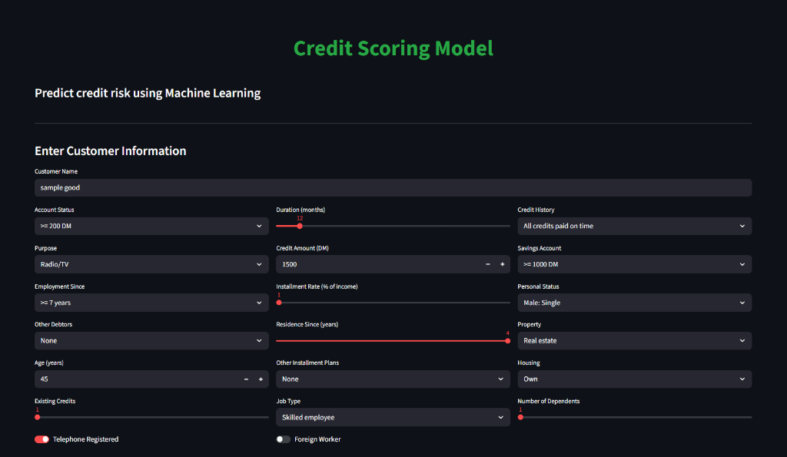
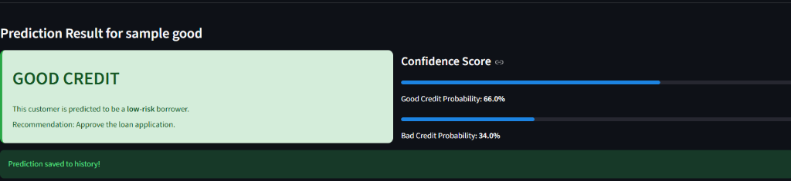

# Credit Scoring & Risk Assessment System

A production-ready **machine learning web application** designed for real-time credit risk assessment.
The system enables financial institutions to evaluate customer creditworthiness instantly using **Logistic Regression, Random Forest, and XGBoost**.

Built with **Python**, **Streamlit**, **Scikit-learn**, and **XGBoost**.

---

## Overview

Credit risk assessment is a critical process for banks and lending institutions. Traditional methods are often manual, slow, and prone to bias. This project automates the decision-making process using historical data patterns trained on the **German Credit Dataset**.

Key capabilities:
- **Low-Latency Inference**: Instant credit score prediction.
- **Multi-Model Architecture**: Switch between Logistic Regression, Random Forest, and XGBoost.
- **Persistent History System**: Automatically logs and tracks all predictions for auditing.
- **Dynamic Risk Classification**: Categorizes applicants into Good, Medium, or Bad risk levels with confidence scores.

---

## Problem Statement

In the modern financial sector, lending decisions face difficult challenges:
- **Speed vs. Accuracy**: Decisions must be fast without compromising on risk evaluation.
- **Data Complexity**: Analyzing multiple factors (age, savings, history, job) simultaneously is hard for humans.
- **Consistency**: Manual reviews can vary between officers.

This project addresses these challenges by implementing a standardized ML pipeline that processes customer data and outputs a consistent, data-driven risk assessment in milliseconds.

---

## System Architecture

- **Frontend**: Streamlit — Provides a responsive, interactive web interface.
- **ML Inference Engine**: Scikit-learn & XGBoost — Handles data preprocessing and real-time prediction.
- **Data Persistence**: Local Storage — Saves prediction history to CSV for persistent tracking across sessions.
- **Model Serialization**: Models are trained and serialized (`.pkl`) for efficient loading.

---

## ML Pipeline

```text
User Input (Form Data)
  ↓
Data Preprocessing
(Label Encoding & Standard Scaling)
  ↓
Model Selection
(Logistic Regression / Random Forest / XGBoost)
  ↓
Inference Engine
(Probability Prediction)
  ↓
Risk Classification Logic
(>60% Good | 40-60% Medium | <40% Bad)
  ↓
History Logging & UI Display
```

---

## Working Sample

The demonstration below shows the end-to-end flow from data entry to risk prediction and history logging.


### Interface Snapshots

| **Customer Data Input** | **Prediction Result** |
|-------------------------|-----------------------|
|  |  |

---

## Run Locally

Follow these steps to set up the project on your local machine.

### ✅ Prerequisites

- Python **3.8+**
- Git

### 1️⃣ Clone the repository

```bash
git clone https://github.com/yourusername/credit-scoring-model.git
cd credit-scoring-model
```

### 2️⃣ Install Dependencies

Create a virtual environment (optional but recommended) and install the required packages.

```bash
pip install -r requirements.txt
```

### 3️⃣ Run the Application

Start the Streamlit server:

```bash
streamlit run app.py
```

The application will launch automatically in your default browser at `http://localhost:8501`.

---

## Tech Stack

- **Core**: Python
- **UI Framework**: Streamlit
- **Machine Learning**: Scikit-learn, XGBoost
- **Data Processing**: Pandas, NumPy
- **Visualization**: Streamlit native charts

---

## License

This project is licensed under the MIT License - see the [LICENSE](LICENSE) file for details.
